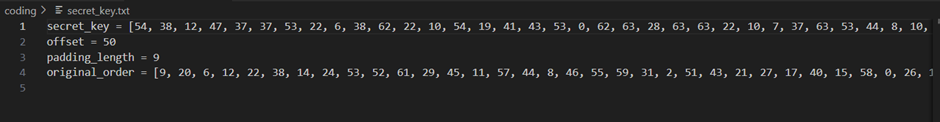
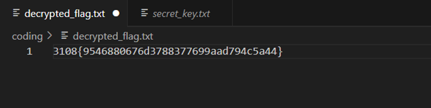

Soalan:

Balikkan proses penyulitan untuk mendedahkan bendera tersembunyi. Bolehkah anda menyahkod bendera dan menyelesaikan teka-teki ~By GoogleTranslate :).

Given the file.txt(key) and the coding file so I go to ChatGPT to remake the code so that it can run smoothly.

](../screenshots/kekacauanhuruf1.png)

And the key in the same file in order the coding to execute

And it will gave the flag

Flag=3108{9546880676d3788377699aad794c5a44}
