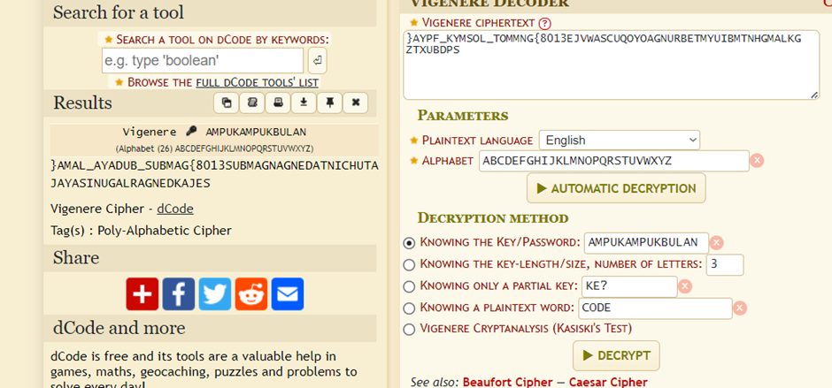
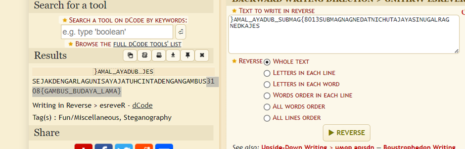

Soalan:
Semasa Syah berada di Muzium Kota Kayang, dia telah menyaksikan sebuah persembahan Gambus yang dipersembahkan oleh seorang pemuzik dari Sabah yang berkunjung ke muzium tersebut. Lagu yang dipersembahkan ketika itu bertajuk Ampuk Ampuk Bulan. Kagum akan persembahan tersebut, beliau telah meninggalkan satu pesanan di bawah bersama kunci. Bolehkan anda merungkaikan pesanan tersebut dan mendapatkan Flag

Cipher : }AYPF_KYMSOL_TOMMNG{8013EJVWASCUQOYOAGNURBETMYUIBMTNHGMALKGZTXUBDPS Key : AMPUKAMPUKBULAN
This question given the cipher text with key so it hinted it could be vignere so I try using vigenere decipher tool

And reverse it since the answer given is on reversed

Flag=3108{GAMBUS_BUDAYA_LAMA}
