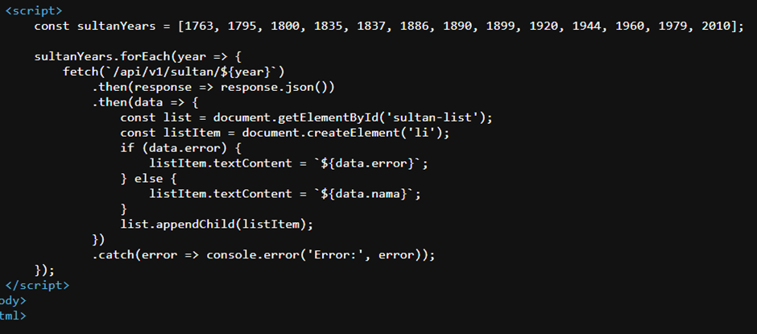
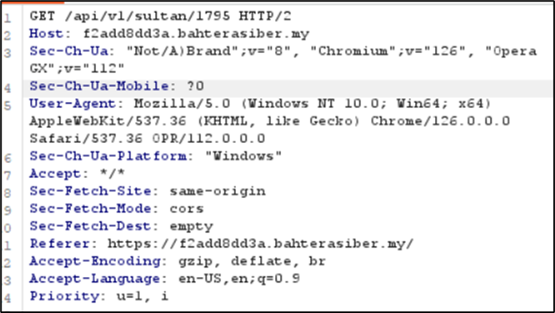

Soalan:
Berikut merupakan senarai pemerintahan Sultan-Sultan Kelantan, yang telah memimpin negeri ini sejak abad ke-18. Setiap Sultan membawa kisah dan peranannya yang tersendiri dalam membentuk sejarah Kelantan. Namun, terdapat Sultan yang hilang dari senarai ini.
https://f2add8dd3a.bahterasiber.my/

From here I search for the missing sultan and that is sultan Muhammad III and I inspect and found the date of the pemerintahan

So I decided to use Burp Suite

From here it forward with the date like get /api/vl/sultan/1795 so I change to /1889 the date sultan III and look for the details in https history

Screenshots/sultan3.png
And found the flag 3108{Putera_sulong_Sultan_Ahmad}
