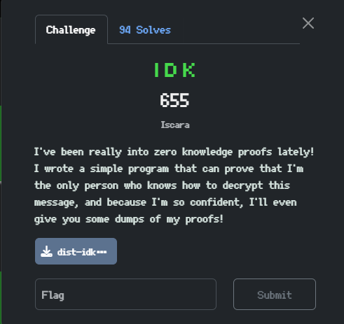

## 🧠 Challenge Overview

The challenge implements a variant of **DSA (Digital Signature Algorithm)** with some quirks:

- The private key `x` is unknown.
- The ephemeral key `k` used in the signatures is **leaked**.
- You're allowed to request **two signatures**, then you must **forge** a signature on the fixed message `"gib flag pls uwu"`.

---

## ✍️ Signature Format

The server signs messages using the DSA-style signature:
R = g^k mod p
S = (H(m) - x*r) * k⁻¹ mod (p-1)
Where:
- `H(m)` is the SHA-256 hash of the message (interpreted as an integer)
- `g, p, y` are public DSA parameters
- `x` is the private key
- `k` is a random ephemeral nonce

The server **leaks `k`** and allows you to obtain 2 signatures, but you must use that information to recover `x`, then forge a signature.

---

## 🔓 Attack Explanation

We use the leaked `k` and two collected signatures to recover `x`.

Given:
S1 = (H(m1) - xr) * k⁻¹ mod (p-1)
S2 = (H(m2) - xr) * k⁻¹ mod (p-1)

Subtracting:
S1 - s2 = (H(m1) - H(m2)) * k⁻¹ mod (p-1)
→ s_diff = h_diff * k⁻¹ mod (p-1)
→ k = h_diff * s_diff⁻¹ mod (p-1)

Once `k` is known, plug back into the equation to solve for `x`:
X = (H(m1) - s1*k) * r⁻¹ mod (p-1)

## 🧪 Exploit Script

```python
from Crypto.Random.random import getrandbits
from pwn import *
from Crypto.Util.number import *
import hashlib
import json
from math import gcd

def hash_m(m):
    sha = hashlib.sha256()
    sha.update(long_to_bytes(m))
    return bytes_to_long(sha.digest())

while True:
    conn = remote("challs.nusgreyhats.org", 33301)
    try:
        conn.recvuntil(b"Welcome")

        # Read parameters
        while True:
            line = conn.recvline().decode().strip()
            if line.startswith("k:"):
                k_val = int(line.split(":")[1].strip())
                break
            elif len(line.split()) == 3:
                p_str, g_str, y_str = line.split()
                p = int(p_str)
                g = int(g_str)
                y = int(y_str)

        # Request two signatures
        msgs = [getrandbits(64), getrandbits(64)]
        sigs = []
        for m in msgs:
            conn.recvuntil(b"> ")
            conn.sendline(b"2")
            conn.recvuntil(b"Send me a message:")
            conn.sendline(json.dumps({"m": m}).encode())
            s_line = conn.recvline().decode()
            s_val = int(s_line.strip().split()[-1])
            sigs.append((m, s_val))

        # Compute r
        r = pow(g, k_val, p)
        if gcd(r, p - 1) != 1:
            conn.close()
            continue  # Retry if r is not invertible

        # Recover private key x
        m1, s1 = sigs[0]
        m2, s2 = sigs[1]
        h1 = hash_m(m1)
        h2 = hash_m(m2)
        s_diff = (s1 - s2) % (p - 1)

        if gcd(s_diff, p - 1) != 1:
            conn.close()
            continue

        h_diff = (h1 - h2) % (p - 1)
        k = (h_diff * inverse(s_diff, p - 1)) % (p - 1)
        x = ((h1 - s1 * k) * inverse(r, p - 1)) % (p - 1)

        # Forge signature on the target message
        target_msg = b"gib flag pls uwu"
        m_target = bytes_to_long(target_msg)
        h_target = hash_m(m_target)
        s_forge = ((h_target - x * r) * inverse(k, p - 1)) % (p - 1)

        # Submit forged signature
        conn.recvuntil(b"> ")
        conn.sendline(b"1")
        conn.recvuntil(b"Send me a message and a signature:")
        payload = {"m": m_target, "r": r, "s": s_forge}
        conn.sendline(json.dumps(payload).encode())

        # Print flag
        print(conn.recvall(timeout=5).decode())
        break

    except EOFError:
        conn.close()
        continue

    ```

 grey{h_h_H_h0wd_y0u_Do_tH4T_OMO}
