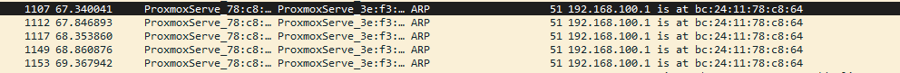

From the picture above, the packet have encoded base64 in ARP protocol partially with every packet send. When we combine it wil be Z3JleXtkMWRfMV9qdXM3X2dlN19wMDFzb24zZH0= then decode it.

grey{d1d_1_jus7_ge7_p01son3d}
