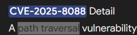

# TOOL USED:
- Time Explorer
- MFTECMD

### Task 1:What is the CVE assigned to the WinRAR vulnerability exploited by the RomCom threat group in 2025

Answers:CVE-2025-8088

### Task 2:What is the nature of this vulnerability

Answers:Path Traversal

### Task 3:What is the name of the archive file under Susan's documents folder that exploits the vulnerability upon opening the archive file

](<screenshots/task 3.png>)

Answers:Pathology-Department-Research-Records. rar

### Task 4:When was the archive file created on the disk

](<screenshots/task 4.png>)

Answers:2025-09-02 08:13:50

### Task 5:When was the archive file opened

](<screenshots/task 5.png>)

In USN Journal, filter. rar extension and thee for ObjectIDChange.
Answers:2025-09-02 08:14:04

### Task 6:What is the name of the decoy document extracted from the archive file, meant to appear legitimate and distract the user

](<screenshots/Task 6.png>)

Answers:Genotyping_Results_B57_Positive.pdf

### Task 7:What is the name and path of the actual backdoor executable dropped by the archive file

](<screenshots/task 7.png>)

Then go to mft to find full path.
Answers:C:\Users\Susan\Appdata\Local\ApbxHelper. exe

### Task 8:The exploit also drops a file to facilitate the persistence and execution of the backdoor. What is the path and name of this file

](<screenshots/task 8.png>)

Filter the time towards the opened of the. rar file(2025-09-02 08:14:04) and see what files does it open next and search the full path in mft.
Answers:C:\Users\Susan\AppData\Roaming\Microsoft\Windows\Start Menu\Programs\Startup\Display Settings. lnk

### Task 9:What is the associated MITRE Technique ID discussed in the previous question

](<screenshots/task 9.png>)

I take T1547.009 because it is realted to. lnk file.
Answers:T1547.009

### Task 10:When was the decoy document opened by the end user, thinking it to be a legitimate document

](<screenshots/task 10.png>)

Filter in USNJ to genotyping and filter the time and see ObjectIDChange.
Answers:2025-09-02 08:15:05
