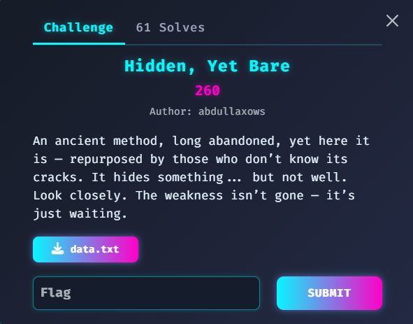

```python
import math

n = 18363834520154637409068651871130337547211955945097912227682758482254784938816280297335436727742659687922688888480538695438507837909813610303294585339150026713081868984296360083802649788199475494264585226690242964772526076944195629131257257784674081646123571182467981401676051240576402327849503455224740437142747520805090918194125334038743779643268230611019022057293315192767025669453805874177564353198561653103399125296983193494366842009730383776028058910659202106863526720518596213785934285859051598744086532520335893999918947390267212332247511640554005867605324990518753914168546633036564036768858795340262552756589
e1 = 65537
c1 = 14562522089852150821125508210135545458074611158977389667559481038834438249823933509585393122094844328236055650583918113794152058260558194915220514637383667334909755821427176713519389943319370196986848478108248485265431768930485423805704614919878254421262393909221642347835119289932304331444700471814580697004071039438497794729136993329202423493239583367936927314288456200625901493749835924886834195384159737889610522681242063983660629058377853441014849041540987872183594927207461927747681867324399091425455785829784455805483712416731010270655355148444753187154292761203054361676413883743718313867409006662548147198837
e2 = 65539
c2 = 3979216856150654301187386051900855660671497800967242127966280370244021511119919860225588481433426020682122649740757080068650307178319340000066466906380964884306380032939913635516480822379947764656457562903556124204220950188206609773512078395000053902584021723126609271959741074157521021675636658234917615791280226138708785033216836942161701318878289087484832625471505707844396232832778571967385940422529601740032326778244362235565854140109513748257298775377728938519156357075941139254619101981740001709272342321240414494122767841166460272915540818639804538037319832812872720795439421496838956584813039846038453424599

# Compute a and b such that a*e1 + b*e2 = 1
def extended_gcd(a, b):
    if b == 0:
        return (1, 0, a)
    else:
        x0, y0, g = extended_gcd(b, a % b)
        x = y0
        y = x0 - (a // b) * y0
        return (x, y, g)

a, b, g = extended_gcd(e1, e2)
print(f"a = {a}, b = {b}, gcd = {g}")

# Since a or b might be negative, we need to handle negative exponents.
if a < 0:
    # Compute c1_inv = mod_inverse(c1, n) and then c1^a = (c1_inv)^(-a)
    c1_inv = pow(c1, -1, n)
    part1 = pow(c1_inv, -a, n)
else:
    part1 = pow(c1, a, n)

if b < 0:
    c2_inv = pow(c2, -1, n)
    part2 = pow(c2_inv, -b, n)
else:
    part2 = pow(c2, b, n)

m = (part1 * part2) % n

# Convert the integer to bytes to get the flag
plaintext = m.to_bytes((m.bit_length() + 7) // 8, 'big')
print(plaintext.decode())
```
Flag:n3xt{c0mm0n_m0dulus_is_a_c0mm0n_mist4k3}
